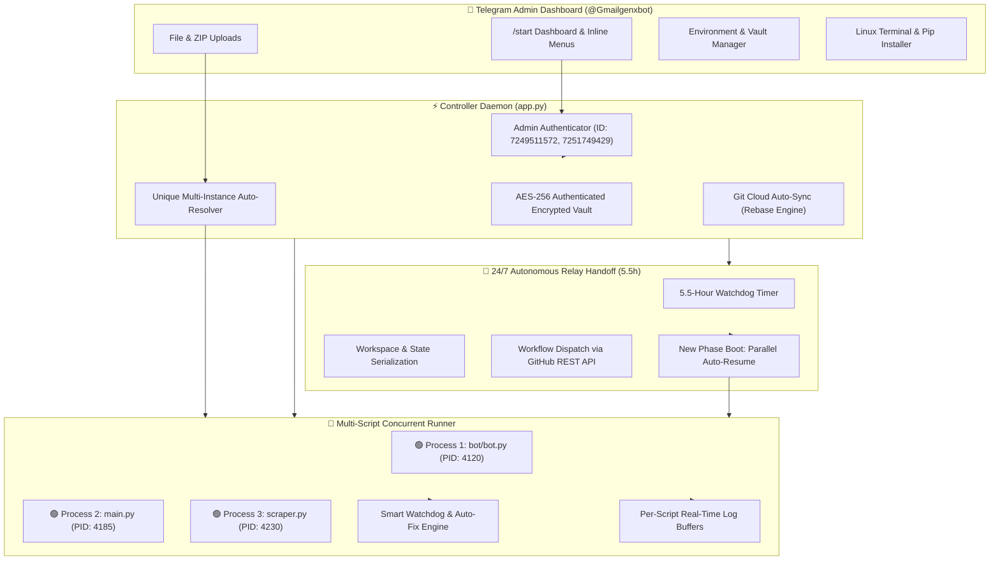

# ⚡ Telegram Cloud Server Relay Daemon (testgitonly)
### 📖 Comprehensive Project Analysis & Architecture Documentation

---

## 🌟 Executive Summary

**Telegram Cloud Server Relay Daemon** is an enterprise-grade, fully autonomous **24/7 cloud execution platform** engineered to host, manage, monitor, and scale Python bots, web scrapers, userbots, and multi-file projects directly from Telegram on high-speed 4-core, 16 GB RAM cloud runners with **zero downtime**.

The system transforms GitHub Actions into an always-on, self-healing server infrastructure with parallel multi-process capabilities, client-side AES-256 authenticated encryption, automated dependency resolution, and real-time interactive Telegram dashboards.

---

## 🏗️ System Architecture & Workflow



---

## 🚀 Core Features & Capabilities

### 1. 🔀 Multi-Script Concurrent Runner Engine
* **True Parallel Execution:** Run multiple independent bots, scrapers, and background tasks simultaneously on 4-core, 16 GB RAM runners.
* **Isolated Process Tracking:** Each running process has its own isolated PID, start timestamp, uptime counter, and real-time standard output/error log buffer.
* **Independent Controls:** Start, stop, or restart any single script without affecting other running scripts. A 1-click `[ 🛑 Stop ALL ]` option is also available.

### 2. 🆔 Unique Multi-Instance Auto-Resolution Engine
* **Conflict-Free File Uploads:** Uploading duplicate filenames (e.g. uploading a 2nd `main.py` while `main.py` is currently running) triggers a smart interactive action menu:
  * `[ 🔀 Run Parallel (main_2.py) ]` ➔ Automatically assigns a unique instance ID and launches both side-by-side in parallel.
  * `[ 🔄 Replace & Restart ]` ➔ Gracefully stops the old PID, updates the code on disk, and restarts immediately.
  * `[ ✏️ Save with Custom Name ]` ➔ Allows the admin to rename the file dynamically in chat (e.g. `worker_bot.py`).
  * `[ ❌ Cancel ]` ➔ Safely aborts the upload without touching active processes.

### 3. 🔄 24/7 Zero-Downtime Autonomous Relay Daemon
* **Infinite Execution via Relay Transitions:** Runs autonomously on GitHub Actions runners within the 6-hour job execution limit.
* **Smart 5.5-Hour Handoff:** At 5.5 hours, the controller serializes workspace state, backs up databases, commits changes, and self-triggers the next phase via GitHub REST API dispatch.
* **Parallel Auto-Resume on Boot:** All previously active scripts are automatically restored and booted in parallel on the new runner phase.
* **Explicit Stop Preservation:** If an admin explicitly stops a script via Telegram, it remains stopped across restarts and does not auto-resume until commanded.

### 4. 🔐 AES-256 Authenticated Secret Vault Shield
* **100% Secret Scanner Immune:** Private environment variables and bot tokens stored in `bot_config.json` are encrypted using AES-256 Counter (CTR) Mode + HMAC-SHA256 authenticated encryption.
* **Automatic Decryption & Local Binding:** On runner boot, the controller decrypts the vault into local `.env` files inside project directories so libraries like `python-dotenv` work out-of-the-box.
* **Push Protection Compatibility:** Plaintext secrets never appear in Git commits, preventing GitHub Secret Scanner (`GH013`) push rejections.

### 5. 📦 Smart Project ZIP & Multi-File Architecture
* **Automatic ZIP Unpacking:** Send any `.zip` archive directly in Telegram. The system auto-extracts the project into an isolated directory (e.g. `scripts/bot/`).
* **Intelligent Entry-Point Filter:** Automatically distinguishes between primary entry points (`main.py`, `bot.py`, `app.py`, `server.py`) and library modules (`database.py`, `models.py`, `utils.py`), preventing unwanted execution of sub-modules while ensuring full import availability.
* **Project Bundling & Download:** Project directories can be re-bundled and downloaded as `.zip` archives directly from Telegram.

### 6. 🛠️ Self-Healing Auto-Fix & Watchdog Engine
* **Real-Time Module Crash Detection:** If a script crashes with `ModuleNotFoundError: No module named 'xyz'`, the watchdog catches the error, parses the missing package name, and provides a 1-click `[ 📦 Auto-Install xyz ]` button.
* **Auto-Requirement Tracking:** Installing missing packages dynamically appends them to the script's dedicated `.requirements.txt` file and commits the update to GitHub.

### 7. 💻 Remote Linux Shell & Pip Terminal
* **Live Shell Execution:** Execute bash commands (e.g. `ls -la`, `df -h`, `python --version`) directly from Telegram with styled HTML output.
* **Interactive Pip Installer:** Install any Python package on-demand in real-time.

### 8. ℹ️ Real-Time Server & Repository Intelligence Dashboard
* Displays server uptime, CPU load, memory usage, and running process telemetry.
* Live GitHub API telemetry showing repository visibility, size, default branch, owner, and current GitHub Actions run ID.

---

## 📁 Repository File Structure

```text
/
├── .github/
│   └── workflows/
│       └── server.yml          # GitHub Actions 24/7 Relay Workflow Daemon
├── scripts/                    # Persistent Cloud Storage for Bots & Projects
│   ├── bot/                    # Multi-File Bot Project
│   │   ├── bot.py              # Main Application Entry Point
│   │   ├── database.py         # SQLite / JSON Database Module
│   │   ├── database.json       # Persistent Database Storage
│   │   └── requirements.txt    # Project Dependencies
│   └── (user scripts...)       # Additional uploaded standalone & multi-file bots
├── app.py                      # Master Relay Controller & Telegram Orchestrator
├── bot_config.json             # Encrypted Vault & Active Instance State
├── requirements.txt            # Core Daemon Dependencies
├── .gitignore                  # Security Scanner Protection Filter
└── Analyse.md                  # Project Analysis & Architecture Guide
```

---

## ⚙️ Technical Specifications & Stack

| Component | Technology | Description |
| :--- | :--- | :--- |
| **Host Environment** | Linux (Ubuntu) | GitHub Actions Runner (4 vCPU, 16 GB RAM, 10 Gbps Network) |
| **Core Daemon** | Python 3.10+ | Asynchronous event loop, Telegram Long-Polling, Subprocess Orchestration |
| **Security Encryption** | AES-256 CTR + HMAC-SHA256 | Master key derived via SHA-256 from repository secrets |
| **Persistence Layer** | Git + GitHub REST API | Automated rebase-pull commit engine for state and database synchronization |
| **Process Management** | `psutil` + `subprocess.Popen` | Independent process tree monitoring, watchdog, and stream capture |
| **Telegram API** | Pure HTTP REST (`requests`) | Lightweight, zero-overhead Telegram Bot API communication |

---

## 🔒 Security & Access Control

* **Admin Authorization:** Only verified Telegram Admin IDs (`7249511572`, `7251749429`) can access controls, execute shell commands, upload scripts, or view logs.
* **Safe Token Resolution:** All sensitive tokens (`TG_BOT_TOKEN`, `GH_PAT`) are injected strictly via GitHub Repository Secrets and never hardcoded.
* **Isolated Script Environments:** Each running script runs with its own project root in `PYTHONPATH` and working directory.

---

## 👨‍💻 Project Information

* **Repository:** [`youganksaini35-hash/testgitonly`](https://github.com/youganksaini35-hash/testgitonly)
* **Owner:** `youganksaini35-hash`
* **Bot Username:** `@Gmailgenxbot`
* **Status:** 🟢 **Active & 24/7 Operational**
